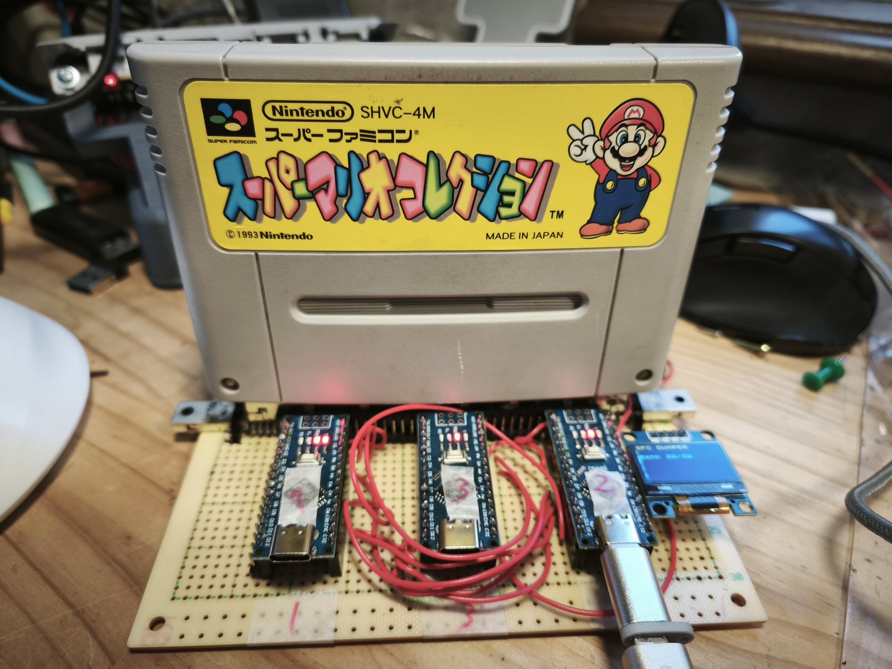
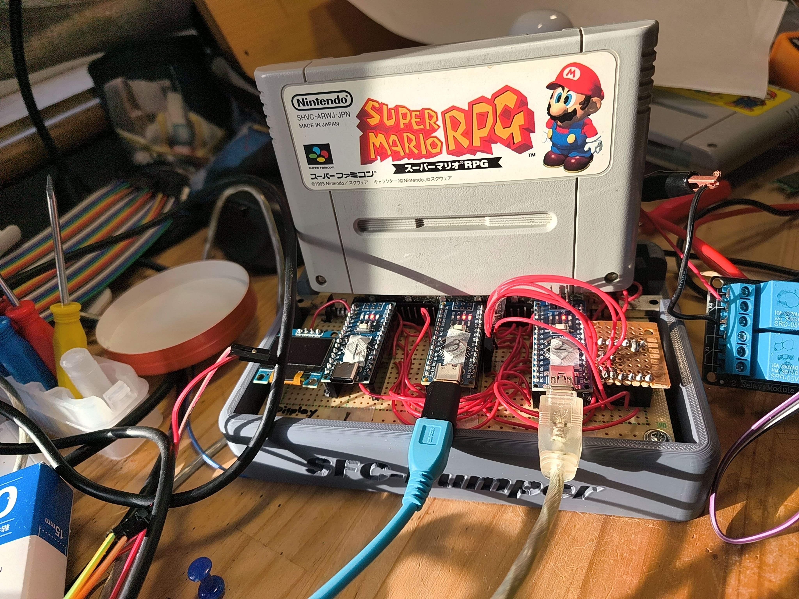
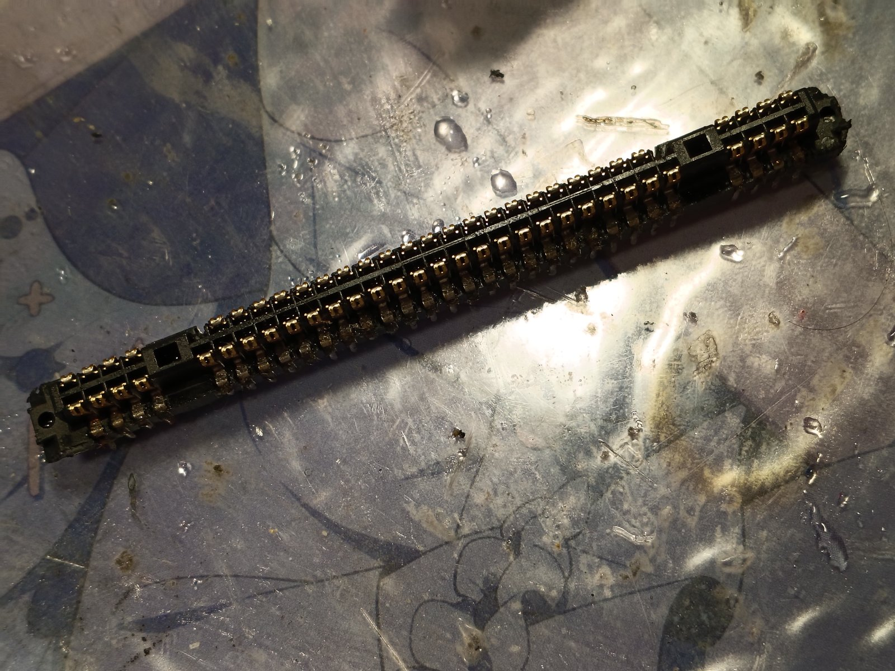
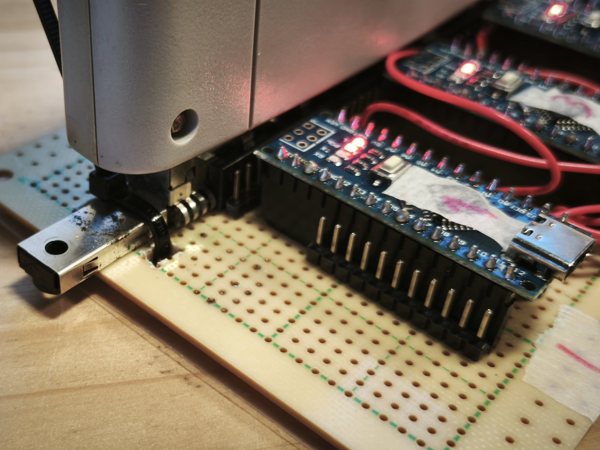
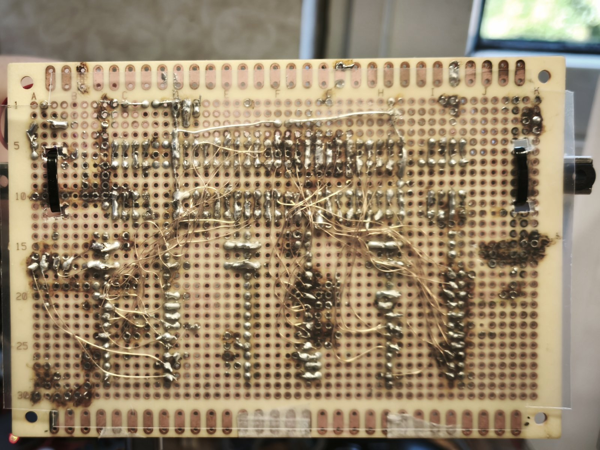
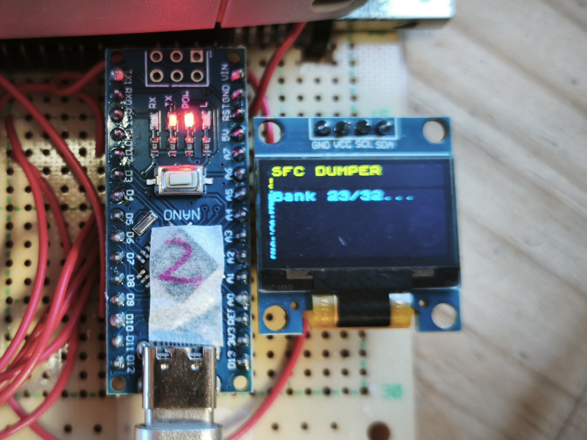
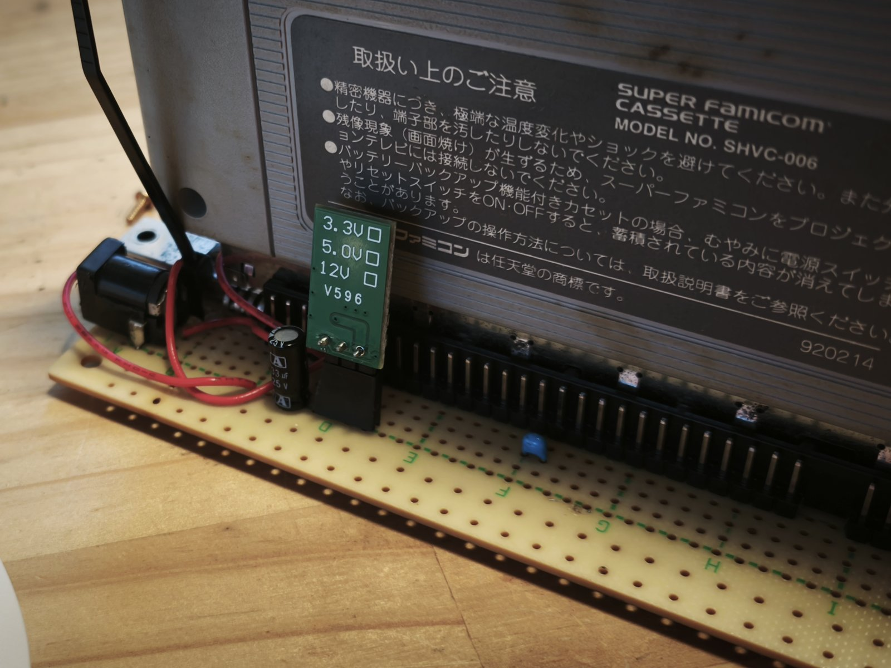
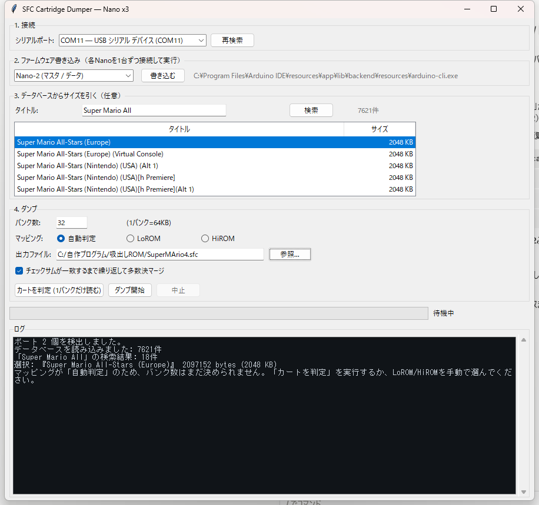

# SFC (Super Famicom) Cartridge Reader — Nano x3

Arduino Nano 3台だけでスーパーファミコンのカートリッジROMを読み出すプロジェクト。

ESP32-S3やレベル変換IC、シフトレジスタ(74HC595)を一切使わず、**5VネイティブなNanoを
「アドレス生成」「データ読み取り」「バンク生成」の3役に分担させる**ことで、
手持ちのNano以外の追加部品ゼロで構成しています。



*スーパーマリオコレクション（SHVC-4M）をダンプ中。ユニバーサル基板にNano×3とOLEDを直付けし、
カートリッジコネクタを載せただけの構成。PCBは使っていない。*

> **自分でも作ってみたい方へ** → **[製作・使用ガイド (docs/GUIDE.md)](docs/GUIDE.md)**
> 部品表、コネクタ加工のコツ、配線表、書き込み手順、検証方法、
> トラブルシューティングをまとめてあります。
>
> **ここに至るまでの経緯** → **[開発史 (docs/HISTORY.md)](docs/HISTORY.md)**
> 踏んだ地雷と誤診の記録。「なぜこの設計なのか」はこちらに書いてあります。

## なぜNano×3なのか

SFCカートを読むには最低でも **アドレス24本 + データ8本 + 制御2本 ≒ 34本** のI/Oが要ります。

| 構成 | 問題点 |
|---|---|
| ESP32-S3 単体 | 5Vトレラントでないため、カートの5V出力を直結すると壊れる。レベル変換IC必須 |
| Arduino Uno 単体 | 5Vネイティブで電圧問題はないが、使えるI/Oが18本しかなく全く足りない |
| Arduino Mega 2560 | I/O 54本で直結でき最も素直（Sanni's Cart Readerがこの構成）。ただし買い足しが必要 |
| **Nano × 3** ← 本プロジェクト | **手持ちのみで完結。全ボードが5Vネイティブなので電圧問題が原理的に発生しない** |

Raspberry Pi Zero 2 を併用する案も検討しましたが、3.3V系のためデータバス8本＋ACKに
分圧抵抗が18本ほど必要になり、「手持ち部品だけで完結する」という利点が失われるため見送りました。

## 構成

```
                    ┌──────────────┐
   A0-A15 ─────────>│              │
                    │  SFCカート   │
   A16-A23 ────────>│  (62pin)     │
                    │              │
   /RD,/ROMSEL ────>│              │
                    └──────┬───────┘
                           │ D0-D7
                           v
  [Nano-1]  <--STROBE--  [Nano-2]  --STROBE-->  [Nano-3]
  A0-A15生成             マスタ/データ読取      A16-A23生成
                         + OLED + USB
                              │
                              v  USBシリアル (1,000,000 bps)
                             PC
```

| ボード | 役割 | スケッチ |
|---|---|---|
| Nano-1 | カートアドレス **A0-A15** を生成。STROBEの立ち上がりで16bitカウンタを+1、RESETで0クリア。**ピン変化割り込み(PCINT)で受ける** | [nano1_addr_low/](nano1_addr_low/) |
| Nano-2 | `/RD`・`/ROMSEL`制御、**D0-D7**読み取り、USBシリアルでPCへストリーム、SH1106 OLEDへ進捗表示 | [nano2_master/](nano2_master/) |
| Nano-3 | カートアドレス **A16-A23**（バンク）を生成。Nano-1と同じくSTROBE方式＋PCINT | [nano3_bank/](nano3_bank/) |

`/WR` と `/RESET` はカート側で +5V に直結（読み出し専用のため）。

**通常のカートではCICロックアウトチップは関係ありません。** CICは本体側のリセット線を
駆動するだけで、ROMバスを塞いではいないので、無視してアドレスを叩けば読めます。
**ただしSA-1カートは例外で、CIC認証が必要です**
（[SA-1はクロックを与えず、CIC認証を通して読む](#sa-1はクロックを与えずcic認証を通して読む)）。

## 実機の写真



*3Dプリントしたシェルに基板を収めた状態。スーパーマリオRPG（SA-1）を読み出している。
左からOLED、Nano-3、Nano-1、Nano-2、右端が電源リレー。USBは2本（Nano-2とUno）。*

- 手書きのポンチ図: [docs/schematic-sketch.pdf](docs/schematic-sketch.pdf)
- **シェル（筐体）**: [hardware/shell/](hardware/shell/) — 基板を収める外装。
  裏面の配線を保護し、カートリッジの抜き差しで基板がたわむのも防げる
  - `shell_dumper.stl` — 本体シェル
  - `SFC.stl` — 天面のロゴ
- 3Dプリント部品: [支柱.stl](支柱.stl) — **4本印刷して基板の四隅に取り付ける脚**。
  裏面は配線がびっしり出ているので、机に直置きすると断線やショートの原因になる
  （シェルを使う場合は不要）

| | |
|---|---|
|  |  |
| **ジャンクのスーパーファミコンから取り外した62pinコネクタ。** これが本プロジェクトで唯一「買わずに済ませた」最大の部品。ピッチ2.50mm・列間隔もキー溝も非標準なので、2.54mmのユニバーサル基板に載せるためキー溝を超音波カッターで切断している。 | **Nanoはピンソケットではなくピンヘッダで直付け。** 基板が2.54mmグリッドなので、コネクタ側の寸法差はここで吸収せず力技で押し込んでいる。 |
|  |  |
| **裏面の配線。** Nano↔カートリッジ間はすべてUEW（ポリウレタン銅線）、それ以外はAWG22のビニール導線。アドレス24本＋データ8本＋制御を手配線している。 | **SH1106 OLEDによる進捗表示。** ハードウェアI2Cピン(A4/A5)はカートのデータバスD4/D5で埋まっているため、ソフトウェアI2CでD11/D12に逃がしている。 |



*当初は電源不足を懸念してDC12V入力＋降圧モジュール(3.3V/5.0V/12V可変のV596)を用意したが、
結局USBケーブル1本のバスパワーだけで3台のNano＋OLED＋カートが安定動作したため未使用に終わった。
写真手前の青い部品と電解コンデンサがパスコン。*

## ソフトウェア

### GUIアプリ（推奨）

**[最新版の実行ファイルをダウンロード（Releases）](https://github.com/SHIMA-R7/sfc-nano-reader/releases/latest)**
— Windows向け単一exe。Pythonのインストール不要です。

ソースから動かす場合:

```bash
python gui/sfc_dumper_gui.py
```

ブラウザ不要、Python標準のTkinterのみ（追加依存は `pyserial` だけ）。



- **COMポート選択**と自動検出
- **ファームウェア書き込み** — Nano-1/2/3を選んでボタン1つ（`arduino-cli`のパスも自動発見）
- **ROMサイズの指定を3通りから選べる**
  1. **自動判定** — 1バンクだけ読んでヘッダからLoROM/HiROM・サイズ・タイトルを認識
  2. **手動** — バンク数とマッピングを直接入力
  3. **データベース検索** — タイトル名で検索して正確なバイト数を引く（後述）
- **チェックサムが一致するまで自動でダンプを繰り返し、複数サンプルをマージ**
  （バイト単位の多数決とビットORの両方を試し、チェックサムが一致した方を採用する）
- **ダンプ方式を選べる**
  - **2回読んで一致するまで繰り返す**（推奨・速い）
  - **多数決マージ** — 何度読んでも一致しないカート向け。窓ごとの外れ値排除、
    ビット単位の再構成、決着しないバンクだけタイミングを上げて読み足す
    （[host/contact_merge.py](host/contact_merge.py) と同じ実装を共有）
- **タイミング掃引ボタン** — 同じバンクを5段階で2回ずつ読み、
  「タイミング不足 / 接触 / Super FX」のどれなのかを切り分けて、適切な段階を自動で選ぶ
  （[切り分けの根拠](#0xff率が動くかどうかで接触とタイミング不足を切り分ける)）
- **キャッシュのカート照合** — 前回のサンプルを再利用する前に1バンクだけ読んで、
  同じカートかを突き合わせる。違えばその場で止まる
- **2の累乗でないROMの検出** — 読んだ長さで合わなければ短いサイズも試し、
  末尾のミラーを切り落とす（12Mbitのカートが2MBと名乗る問題への対処）

### CLI

```bash
# バンク単位で読む（推奨）。1バンクごとにリセットし、2回読んで一致するまで繰り返す
python host/dump_by_bank.py --port COM12 --banks 64 --mapping lorom --out MyGame.sfc
```

長時間の連続読み出しで誤りが出る問題（後述）を避けられるので、この方式が最も確実です。
確定したバンクは `<出力名>.banks/` にキャッシュされ、中断しても続きから再開できます。

```bash
# 通しで一気に読む（要ファーム変更: バンク単位モードを外す）
python host/receive.py COM12 2097152 dump.bin

# 通しダンプを繰り返してマージ（多数決 / ビットOR）
python host/dump_until_valid.py --port COM12 --banks 32 --mapping hirom --out MyGame.sfc
```

```bash
# 接触が悪くて「2回一致」が永久に取れないカート用。窓ごとの多数決で押し切る
python host/contact_merge.py --port COM12 --banks 64 --mapping lorom --out MyGame.sfc

# カートを挿し直した/配線を変えた直後は、それまでのサンプルを退避してから
python host/contact_merge.py --port COM12 --banks 64 --mapping lorom --out MyGame.sfc --fresh

# 既に取ってあるサンプルだけでマージし直す（カートを挿さなくてよい）
python host/contact_merge.py --merge-only --banks 64 --mapping lorom --out MyGame.sfc
```

生サンプルは `<出力名>.votes/` に1本ずつ残り、中断しても続きから積み増せます。
決着しなかったバイトは `<出力名>.report.txt` に位置が出ます。詳細は
[接触不良のカートを回数で押し切る](#接触不良のカートを回数で押し切る)。

### セーブデータ（バッテリーバックアップSRAM）の吸い出し

GUIの「5. セーブデータ」から実行できます。「カートを判定」を先に押すと、ヘッダから容量を
読んでボタンが有効になります。CLIなら:

```bash
python host/dump_sram.py --port COM12 --rom MyGame.sfc --out MyGame.srm
```

ROMは焼き直せば同じものが手に入るが、**セーブデータは世界に1つしかない**。しかもカート内の
ボタン電池は寿命が近く、切れた瞬間に永久に失われる。ROMより優先度が高い。

`--rom` に検証済みのROMを渡すと、そのヘッダからマッピングとSRAM容量を読んで自動設定する。
出力した `.srm` はそのままRetroArchの `saves/<コア名>/` に置けば実機の続きから遊べる
（夜光虫で3スロットぶんのセーブが読み込めることを実機確認済み）。

**書き込み事故は原理的に起こらない。** `/WR` はカート側で +5V に直結してあるので、
ファームに何を書こうとSRAMへの書き込みは物理的に発生しない。読み出し専用として作った
配線が、そのまま救出対象を守る安全装置になっている。

#### /ROMSEL の極性はマッピングで逆になる

ここが唯一の落とし穴だった。当初は「SRAMはROMとは別物だから `/ROMSEL` をアサートしない」と
考えて実装したが、LoROMでは全バイトが 0x00 になった。SNESの `/CART` がアサートされる条件は
**「バンク $40-$7D は全アドレス、バンク $00-$3F は $8000-$FFFF のみ」** なので:

| マッピング | SRAMの位置 | `/ROMSEL` |
|---|---|---|
| LoROM | `$70:0000-$7FFF` | **アサートする**（バンクが $40-$7D 側） |
| HiROM | `$20:6000-$7FFF` | **アサートしない**（$8000未満） |

全バイト0x00を見て「電池切れか」と早合点しなかったのは、**電池が切れていてもSRAMチップ自体は
カート動作中は+5Vで動くので、読めば何かしら返るはず**という理屈があったため。0x00で埋まるのは
「誰もバスを駆動していない」ときの症状で、これはROMダンプ時にも観測済みだった。

#### ミラーを検証に使う

SRAMの実容量(2KB〜32KB)はバンクの窓(LoROM 32KB / HiROM 8KB)より小さいことが多く、余りには
同じ内容が繰り返し現れる。この繰り返しが一致するかを**1回の読み出しだけで完結する検査**として
使える。ただしカートによってはSRAM外がオープンバスになりミラーが出ないので、判定の主軸は
従来どおり「2回読んで一致」に置き、ミラーは補助的な手がかりとして扱っている。

### データベース検索について

RetroArchに同梱されている `database/rdb/Nintendo - Super Nintendo Entertainment System.rdb`
（No-Intro準拠、7,621件）をそのまま読んでいます。**ネットワークアクセスは不要**です。

このファイルはlibretro独自のバイナリ形式（MessagePack）なので、外部ライブラリを増やさずに
済むよう最小限のデコーダを [gui/rdb.py](gui/rdb.py) に実装しています。

DBを使う利点は、**ヘッダの自己申告が2の累乗に切り上げられている場合があるため**です。
例えば `Super Nazo Puyo Tsuu (Japan)` は実際には 1,572,864 bytes (1.5MB) ですが、
ヘッダのROMサイズバイトは2の累乗でしか表現できません。

## 使い方

1. 62pinカードエッジコネクタ経由でカートと3台のNanoを配線
2. GUIから各ボードにスケッチを書き込み（`arduino:avr:nano:cpu=atmega328old` を使用。
   クローン品はOld Bootloader指定でないと `programmer is not responding` になることが多い）
3. 「カートを判定」でROMサイズを特定し、`nano2_master.ino` の `NUM_BANKS` をその値に変更して再書き込み
4. 「ダンプ開始」

## ハマりどころ（実際に踏んだもの）

### コネクタ

- SFCのカードエッジは **62pin = 表31 + 裏31**。表裏で124本ではない
- ピッチは通称2.54mmではなく **実測2.50mm**。さらに列間隔とキー溝の位置も非標準なので、
  2.54mmグリッドのユニバーサル基板とは完全には整合しない
- 62本のうち相当数はGND/VCCの重複。実際に配線が必要なユニーク信号は
  アドレス24 + データ8 + 制御2 + 電源/GND数本で足りる

### メモリマップ

- **LoROMはバンク内で上位/下位32KBが同一内容にミラーされる**（A15がROM選択に関与しないため）。
  これは故障ではなく正常な電気的挙動。ダンプ後に前半32KBだけ抽出する
- HiROMは1バンク64KBをフルに使う（ミラーなし）

### タイミング

- Nano間の3線シフト転送（DATA/CLK/LATCH）は、2台が**別々の水晶発振子で非同期に動く**ため
  クロック同期でビットを取りこぼす。パルス幅を5us→300usに広げても完全には安定しなかった
- 最終的に **Nano-1と同じ「STROBEでカウントアップ」方式に統一**して解決。
  クロック同期という概念自体が消えるため原理的に安定する（誤り率が数十万バイト→数千バイトに激減）
- ROMのアクセスタイム自体は120〜200ns程度。当初は`/RD`後の待ちを100usも取っていたが、
  下記の割り込み化のあとに実測で詰めて5usまで短縮した（1バイト331us→47us）
- **必要なマージンはカートの個体差でかなり違う。** Super Mario Collection と夜光虫は
  5us（最速）で一発で通ったが、Street Fighter II は5usだと2回連続一致すら得られず、
  100usまで上げてようやく安定した。全カート一律で遅くすると要らないカートの速度を捨て、
  一律で速くすると要るカートで延々と読み直すことになる
- そこで `host/bankio.py` に**段階的エスカレーション**を実装した。最速（5us）から始め、
  規定回数一致しなければ次の段階へ落とす（5→20→50→100→300us）。さらに一度落とした後も
  数バンクごとに最速側を試し直し、通れば速度を取り戻す（`AdaptiveTiming`）。
  タイミング値は起動のたびにPCからファームへ送るので、書き込み直しは不要
- 「2回読んで一致すれば正しい」という検証には落とし穴がある。カートが外れて全バイト0x00に
  なった場合、その出力は**自分自身と必ず一致する**ため素通りしてしまう。
  全バイトが同一値のデータは異常として弾いている（`_is_degenerate`）
- **電源が読み取り品質を支配する。** USBバスパワーで動いてはいたが、消費電流の大きい
  カート（Super FX機など）では読むたび数百バイトが化けた。安定化電源から5Vバスへ直結したら
  連続5回読んで1バイトも違わなくなった。**タイミングをいくら詰めても直らない誤りに出会ったら、
  まず電源を疑うこと。**段階を下げたのに悪化するなら、ほぼ電源で確定（コプロセッサ搭載カートの
  節に実測値あり）

### ストローブの取りこぼし — 最も長く誤診した問題

高速化しようとしてポート直叩き化したところ、データが壊れました。当初は電源やデカップリング、
連続動作による電圧降下を疑いましたが、**すべて外れ**でした。

決定打は、同じバンクを10回読んで**毎回きっかり30,966バイトの相違**が出たことです。
ノイズなら数値がばらつきます。完全に決定的でした。そこでずれ方を総当たりで検算すると:

| 仮説 | 一致率 |
|---|---|
| そのまま `出力[i]==正解[i]` | 5.5% |
| 2倍速 `出力[i]==正解[2i]` | 66.7% |
| **半分 `出力[i]==正解[i÷2]`** | **100.0%** |

**同じアドレスを2回ずつ読んでいた**＝Nano-1がストローブをきっかり1回おきに取りこぼしていた。

ポーリングには「ループを一周する間に来たパルスを取りこぼす」という原理的な穴があり、
Nano-1の処理時間がNano-2の1サイクルより長くなると**必ず半分落ちます**。
パルス幅を60usや100usに広げていたのは、穴を塞がずに誤魔化していただけでした。

**解決: Nano-1/Nano-3をピン変化割り込み(PCINT)に変更。**
エッジをハードウェアがラッチするので、ISRが動く前にパルスが終わっていても取りこぼしません。

その後、待ち時間を掃引して詰めました。**各条件で2回読んで両方とも正解と完全一致した場合のみ合格**
という基準です（単発の一致は当てにならない。実際PULSE=60usは単発では完全一致したのに、
繰り返すと数千バイト化けた）。

| 設定 | 結果 |
|---|---|
| RD=20 ADDR=20 PULSE=5 | 合格 (79us/byte) |
| RD=10 ADDR=10 PULSE=3 | 合格 (57us/byte) |
| **RD=5 ADDR=5 PULSE=3** | **合格 (47us/byte) ← 採用** |
| RD=3 ADDR=3 PULSE=2 | 合格 (42us/byte) |
| RD=2 ADDR=2 PULSE=2 | 合格 (40us/byte) |

最速値ではなく1段手前を採用したのは、カートの接触状態のばらつきに対する余裕のためです。
**331us → 47us/byte（7倍）、2MBが約12分から約3分になりました。**

なお、この真因が判明する前は「複数回ダンプして多数決マージ」で押し切っていました。
Super Puyo Puyo (LoROM 1MB) は27サンプルかけて通しましたが、
Super Mario Collection (LoROM 2MB) は24サンプルでも収束しませんでした。
そちらの真因は別で、**LoROMなのにHiROMと誤判定してデータのない下位32KBを集めていた**ためです。
詳細は [開発史](docs/HISTORY.md) に書いてあります。

### バンク単位で読む方式

[host/dump_by_bank.py](host/dump_by_bank.py) は1バンクごとにNanoをリセットして読み直し、
**2回読んで完全一致するまで繰り返します**。確定したバンクはキャッシュされるので、
中断しても続きから再開できます。統計的なマージが不要になるため、これを推奨します。

### コプロセッサ搭載カート

**一括りに「読めない」と書いていたが誤りだったので訂正した。** コプロセッサには2種類ある。

**Super FX（スターフォックス、ヨッシーアイランド）は読める。** 当初「バスを支配するので
読めない」と書いたが、これも誤りだった。2本ともチェックサム・No-IntroのCRC32ともに一致
(Star Fox `41a60b3f` / Yoshi's Island `343e0dfb`)。詳細は下記。

**SA-1（スーパーマリオRPG、星のカービィ スーパーデラックス）も読める。**
3個体・2タイトルでNo-IntroのCRC32が一致し、Snes9xも `Checksum OK` を出す。
必要なのは **CIC認証** と **カートにクロックを与えないこと**、そして
**1回の接続で64バンクを読み切ること**。詳細は
[SA-1はクロックを与えず、CIC認証を通して読む](#sa-1はクロックを与えずcic認証を通して読む)。

    Super Mario RPG (Japan)                      5527071e
    Hoshi no Kirby Super Deluxe (Japan)          151bd470
    Hoshi no Kirby Super Deluxe (Japan) (Rev 2)  1f35f230

> **2026-08-29 訂正:** 以前ここに「CIC認証もマスタークロックも要らなかった」と書いた。
> **CIC認証について、これは誤りだった。** 詳細は下記の訂正節に書く。
> マスタークロックが不要である点は変わらない。

#### Super FX は「特殊チップだから読めない」のではなかった

スターフォックスは長らく読めなかった。同じバンクを読むたび数百バイトが化け、2回一致が
永久に成立しない。多数決ダンプ(dump_voting.py)まで作って10サンプル積んだが、1MB中
38,937バイトが決着せずCRCも合わなかった。

**原因はGSUではなく電源だった。** 安定化電源から5Vバスへ直結したところ、同じ設定で
連続5回読んで**1バイトも違わなくなった**。その状態で普通にLoROM 32バンクを読んだら、
チェックサムもNo-IntroのCRC32も一発で一致した。

誤診に至った理由は、症状がいかにも「動作中のバスマスタと衝突している」ように見えたこと。
特に**遅くするほど悪化する**という挙動が決定的な誤解を招いた（5us:89バイト相違 →
300us:9828バイト相違）。「読み出しに時間をかけるほどGSUが割り込む機会が増える」と解釈したが、
実際は**遅い設定ほど1バンクの読み出しが長引き、弱い電源を長時間虐めていた**だけだった。

電源改善後に同じ比較をすると、この現象は消える:

| 段階 | 所要 | 2回読みの相違（改善前 → 改善後） |
|---|---|---|
| 高速 (5us) | 15.0s | 89/75 → **0** |
| やや低速 (20us) | 19.2s | 338/611 → **0** |
| 低速 (50us) | 27.8s | 5259/2758 → **0** |
| 安全 (100us) | 42.3s | 1969/1340 → **0** |
| 最安全 (300us) | 99.1s | 2524/9828 → **29** |

**教訓: 段階を下げたのに相違が増えるなら、タイミングではなく電源を疑うこと。**
bankio.py のエスカレーション機構は「遅くすれば安全になる」を前提にしているが、
その前提は電源が健全なときにしか成り立たない。電源が弱いと**自動エスカレーションが
自ら傷口を広げる**。

#### ヨッシーアイランド(GSU-2)は接触が原因だった — 症状が同じでも原因は違う

スターフォックスの次にヨッシーアイランド(2MB / GSU-2)を読んだら、**まったく同じ症状**が出た。
読むたび数百〜数千バイトが化け、バンク1で全段階失敗して止まる。電源が犯人だった直後なので
当然そちらを疑ったが、**外れだった**。

| 疑ったもの | 検証結果 |
|---|---|
| 電源不足 | ❌ 安定化電源が4.99Vを維持 |
| 発熱 | ❌ 触っても熱くない |
| アドレス線・データ線の不良 | ❌ どのビットにも偏りなし(各3.4〜6.6%) |
| **カートの接触** | ✅ **挿し直しで0xFFが12分の1、連続3回で相違0** |

決め手は**数分の間に品質が12倍変動したこと**(上位32KBの0xFFが15,306個→1,268個)。
電気的な設計問題ならこんな不連続な揺れ方はしない。接触なら当然。
持ち主いわく「実機で遊んでいた頃から調子の悪いカセット」で、その一言が測定より早く正解に
近かった。

**同じ症状に同じ原因を当てはめると間違える。** 電源・接触・マッパーの三者は、
どれも「読むたび化ける」という同じ顔で現れる。

#### キャッシュは条件を変えたら捨てること

挿し直し後に64バンクすべてリトライなしで読めたのに、チェックサムが **4だけ**合わなかった
(0x7312 / 期待 0x730e)。原因は、**最初の失敗した実行が接触の悪い状態でバンク0を確定させ、
キャッシュに書き込んでいた**こと。以降の実行はそれを再利用し続けていた。

バンク0のキャッシュを消して読み直したら一発で一致した。

中断から再開できるのがキャッシュの利点だが、**悪条件下で確定したバンクも同じように信頼される**
という裏返しがある。**電源・配線・カートの挿し直しなど条件を変えたら、キャッシュを消してから
やり直すこと。** 今回はチェックサムが捕まえたが、検証手段がなければ壊れたROMを保存していた。

#### 接触不良のカートを回数で押し切る

挿し直しで直らないカートが残る。[host/contact_merge.py](host/contact_merge.py) は
そういう相手に、時間を払って票を積む。ここまでに分かっている壊れ方をそのまま設計に写した。

| 実測されている事実 | 設計への反映 |
|---|---|
| 誤りは**数十〜250バイトの連なり**で出る（あるビットが数十ms張り付く） | 外れ値の判定を**256バイトの窓ごと**に行う。壊れた区間だけ票から外し、同じサンプルの正常な区間は数える |
| **数分の間に品質が12倍変動**する（ヨッシーアイランド） | サンプルを**バンクを一周しながら1本ずつ**集める。同じバンクを連続で読むと、その全部が「悪い数分」に入りうる |
| 誤りは**双方向**（ビット落ち一方向説はコミット `d0d1876` で撤回済み） | **ORは使わない**。バイト単位で決着しない場所だけビット単位の多数決に落とす |
| 0xFF一色の読みは安定していて「2回一致」を通す | 全バイト同一のサンプルは票に入れる前に捨てる |
| 悪条件下で確定したキャッシュも同じ重みで信頼される | `--fresh` で退避してから取り直せる。`.banks` の確定済みバンクは既定では票にしない |

`dump_voting.py`（Super FX用）との違いは、外れ値の判定単位が「サンプル1本まるごと」か
「窓ごと」かにある。1本まるごと捨てる方式だと、途中で浮いただけのサンプルの
**正常な数万バイトまで一緒に捨てる**。接触不良ではそれが頻繁に起きる。

窓ごとの判定は、仮の多数決値を基準にしている以上**循環している**。多数決が丸ごと
間違っている窓では、正しいサンプルの方が外れ値に見える。一方向のビット落ちだと誤断したのは
まさにこの循環が原因だったので、相違の少ない上位3本は必ず残し、判定に「多数派から遠い」
以上の意味は持たせていない。0xFFの密度による除外だけは多数決と独立した指標になる。

決着しなかったバイトは `<出力名>.report.txt` に位置が出る。なお、未決着の候補値を
入れ替えればチェックサムが合う組み合わせは、たいてい**存在してしまう**。それを見つけて
書き戻す `--guess-checksum` も用意してあるが、既定では存在を報告するだけにしてある。
このプロジェクトでチェックサムは「本物かどうか」を決める唯一の材料なので、
自分で合わせにいったらその材料を失う。

#### キャッシュは「どのカートから取ったか」を覚えていない

かまいたちの夜を吸い終わったあと、以前の実行が残していた
`KAMAITACHINOYORU.sfc.banks/` の中身を答え合わせしたら、32,768バイト中**32,191バイトが相違**した。
ずれや化けではない。**中身はスターフォックスだった**（ヘッダのタイトルが `STAR FOX`、
先頭256バイトが `STARFOX.sfc` のオフセット0と完全一致）。

上に「条件を変えたらキャッシュを捨てること」と書いたが、危険はもう一段深い。
**キャッシュが信頼しているのは出力ファイル名だけで、カートの同一性は誰も見ていない。**
カートを差し替えて同じ名前で走らせれば、別のゲームのバンクが黙って混ざる。
チェックサムが捕まえてくれなければ、そのまま保存される。

`contact_merge.py` はキャッシュを再利用するとき、**そのキャッシュが名乗るタイトルを表示し、
開始バンクを1本だけ読んで突き合わせる**。食い違ったらその場で止まる。
1本ぶんの時間で、数時間を無駄にする事故を防げる。

```
既存のサンプル 320 本を再利用します。
  キャッシュのカート: SUPER MARIOWORLD
キャッシュと同じカートかを確認しています…

キャッシュのカートは SUPER MARIOWORLD ですが、今挿さっているのは STAR FOX です。
混ぜると壊れたROMができます。--fresh を付けて取り直すか、--out の名前を変えてください。
```

#### 0xFF率が動くかどうかで「接触」と「タイミング不足」を切り分ける

電源・接触・マッパーが同じ顔で現れることは上に書いた。**タイミングマージン不足**も同じ顔をする。
かまいたちの夜(LoROM 3MB)は連続2回読みで上位32KBが2,271バイト相違し、
0xFFが16.8%もあった。接触不良にしか見えない。

段階を掃引したら答えが出た。

| 段階 | バンク$00 相違 | バンク$28 相違 | 0xFF率 |
|---|---|---|---|
| 高速 (5us) | 3,238 | 1,502 | 0.1675 |
| やや低速 (20us) | 1,028 | 239 | 0.1678 |
| 低速 (50us) | 438 | 51 | 0.1678 |
| 安全 (100us) | 110 | 7 | 0.1677 |
| **最安全 (300us)** | **1** | **0** | 0.1678 |

**判定材料は2つある。**

1. **相違が段階に対して単調に減る** → タイミング。接触なら遅くしても変わらないし、
   Super FXなら逆に悪化する（5us:89バイト → 300us:9828バイト）
2. **0xFF率が動かない** → その0xFFは本物のデータ。接触不良なら跳ね回る
   （ヨッシーアイランドは同じ場所で15,306個→1,268個と12倍動いた）

つまりこのカートの16.8%の0xFFは正常で、**遅く読めば読める**。多数決を何本積むかの問題では
なかった。`contact_merge.py` は追加取得のたびにタイミングを1段上げる（`--no-escalate` で無効化）。
**票で駄目なら微秒を払う**——Super FX用の `dump_voting.py` が最速固定なのとちょうど逆で、
どちらが正しいかは事前に分からないので、掃引して決めるのが確実。

#### 「多数決は完璧、それでも合わない」— サイズの方が嘘だった

ドラゴンクエストI・II を `contact_merge.py` で読んだら、**64バンクすべてが未決着0バイト**
（＝5サンプルが全バイトで一致）なのにチェックサムが合わなかった（0x47b5 / 期待 0x2d8a）。
読みが完全に安定しているのだから、犯人は多数決ではない。

**このカートは12Mbit(1.5MB)で、ヘッダのROMサイズ申告 0x0b は2の累乗に切り上げられた
2MBだった。** 後半4Mbitはアドレス空間に2回現れるので、本体もそう数える。
2MBぶんを素直に足せば当然合わない。

```
1.5MBとして sum(前半1MB) + 2 * sum(後半512KB) = 0x2d8a  → 一致
CRC32 = 98bb6853 → No-Intro の Dragon Quest I & II (Japan) / 1,572,864 bytes と一致
```

`contact_merge.py` の検証はこれを見るようにしてある。全体で合わなければ
「2の累乗」または「2の累乗＋2の累乗」の大きさを順に試し、合った時点でそこまでを実体として
末尾のミラーを切り落とす。DBによるサイズ確認が有効なのと同じ理由（[データベース検索について]
(#データベース検索について)）が、読んだ後の検証側にもそのまま当てはまる。

**「チェックサムが合わない＝読めていない」ではない。** 読みの品質とサイズの解釈は
別々に疑う必要がある。

#### SA-1はクロックを与えず、CIC認証を通して読む

    Super Mario RPG (Japan)                      CRC32 5527071e
    Hoshi no Kirby Super Deluxe (Japan)          CRC32 151bd470
    Hoshi no Kirby Super Deluxe (Japan) (Rev 2)  CRC32 1f35f230

4MBを **95秒** で読み切る。Snes9xも `ROM+RAM+BAT+SA-1` と認識して `Checksum OK` を返す。

**必要な条件:**

| 項目 | 要否 |
|---|---|
| **CIC認証**（本体側Lock役を演じる） | **必要** |
| マスタークロック 21.477MHz（カート1番） | **不要。むしろ有害** |
| システムクロック（カート57番） | **出してはいけない** |
| 1回の接続で全64バンクを読み切る | **必要** |
| リトライ（窓は確率的） | **必要** |
| 接触の良いカート個体 | **必要** |

**クロックを与えてはいけない理由。**
Super FXで到達した「クロックが無いから通せないのではなく、
**クロックが無いから大人しかった**」が、そのままSA-1にも当てはまる。
クロックを与えればSA-1は起きてバス調停を始め、ROMを握ってしまう。
与えなければ眠ったままで、ROMは素通しで読める。
MCKを供給していた時期にSA-1が `0x02` や `0x34` を返していたのは、
起きたSA-1がバスを握っていたからだった。

**CIC認証が要る理由。** カート内蔵のCIC(Key)に対して本体側のLock役を演じ、
ラウンド0の握手を成立させる必要がある。本リポジトリのファームは
`nano3_cicbank`（別リポジトリ）で、電源投入300ms後に自力で認証を実行する。

#### 訂正: 「CIC認証は不要」は交絡した実験による誤りだった

2026-08-28、ここに「CIC認証は不要」と書いた。**誤りである。**

誤った根拠はこうだった。

    ① nano3_cicbank（CIC認証あり）で カービィ成功・再現成功・マリオRPG成功
    ② nano3_bank（CIC認証なし）に書き換えて「CICなしでも5/6で成功」

②を独立した検証だと考えたが、**独立していなかった。**
①でCIC認証を何度も通したあとの状態で②を実行していた。
SA-1のBW-RAMは電池でバックアップされており、状態が電源サイクルを越えて
残る経路が実在する。

**一度も認証していない状態からCICなしで試したのは2026-08-29が初めてで、
結果は 0/16 だった**（カービィ8回・マリオRPG8回、いずれも電源サイクルつき）。
同じ条件でCIC認証を有効にしたところ、**2回目で成功した**（CRC 151bd470）。

順序を変えれば結論が変わる実験を、独立した検証として扱ったのが誤りだった。

#### SA-1のセーブデータは、逆に取り出せない（未達）

ROMとは対称の問題が起きる。CIC認証はどちらにも要る。

    クロックを与えない -> SA-1は眠る   -> ROMが読める / **BW-RAMには届かない**
    クロックを与える   -> SA-1が起きる -> BW-RAMが読める / ROMはSA-1に握られる

**両立しない。** カート1番へのクロック配線1本の抜き差しで切り替わる。

MCKを繋いでCIC認証を成立させると、$6000-$7FFF のBW-RAM窓に実データが現れる
（I-RAM窓も応答する＝SA-1が起動している）。カービィSDXで吸い出した8KBは、
ゲーム自身が初期化する空セーブと**同じ位置に同じ構造**を持っており、
本物のセーブデータであることは間違いない。

しかし**ゲームに読ませると拒否され、空データで初期化される**。
読みごとの相違が8192バイト中27〜166バイトあり、多数決でも詰めきれていない。
セーブデータはROMと違って1バイト違えば全体が無効になる。

    未解決: 読みの誤差なのか、起動したSA-1が自分でBW-RAMを書き換えているのか
    未検証: 同一電源投入内で連続2回読んで比較すれば判別できる

なお**スーパーマリオRPGはSRAM 32KBだが窓は8KB**で、残りはSA-1レジスタ `$2224` の
ブロック切替が要る。`/WR` を +5V に直結した読み出し専用機では書き込めないため
**原理的に到達できない**。カービィSDXはSRAM 8KBなので窓1枚で全部入る。

#### Super FXのセーブはヘッダが容量を偽る

ヨッシーアイランドのヘッダはSRAM容量を **0x00 (=なし)** と申告する。実際には32KBの
バッテリーバックアップRAMがあり、`$70:0000-$7FFF` から読める(バンク `$71` は `$70` の
ミラーだった)。GUIの自動判定は「セーブ領域なし」と表示してしまうので、CLIで手動指定する:

```bash
python host/dump_sram.py --port COM12 --mapping lorom --size 65536 --out YoshiIsland.srm
```

窓の上限が32KBなので、64KBを指定しても32KBが返る。それで全部。
実際にRetroArchへ置いてファイルメニューにセーブが出ることを確認済み。

#### GSUのレジスタ窓は下位32KBにある

読み出しが安定した後も、1バンク(64KB)あたり1,059バイトが 0xFF のまま残る。ただしこれは
問題ではなかった。上下32KBのミラーを比較すると、**相違は `$3000-$34FF` に完全に収まる**。
そこはGSUのレジスタとキャッシュRAMの窓で、丸ごと下位32KB側にある。

LoROMのROMは各バンクの**上位32KB**にしか出ないので、そもそも重ならない。残りの 0xFF は
ROMに実在するパディングで、上下のミラーに同じ位置で現れることがその証拠になる。

#### カートへのクロック供給は Super FX には逆効果

Nano-2 の D11(OC2A) から 1MHz を PHI2(カート57番) へ供給できるようにしてある
(フラグ bit2、既定は供給しない)。SA-1やCIC関連には必要になるが、**Super FXでは有害**。

クロックが無い間GSUは眠っていてROMが見えるが、与えた途端に起きてバスを完全に奪い、
読めるのは4種類の16バイトブロックが延々と続くオープンバスだけになる。
「クロックが無いから通せない」ではなく「**クロックが無いから大人しかった**」が正解だった。

#### `/RESET` を引いた結果（否定的結果）

+5Vに直結していた `/RESET` を Nano-2 の D7 へ引き直し、コプロをリセット保持できるように
した。しかし**Super FXにもSA-1にも効果はなかった**。カートエッジの `/RESET` は主に
カート内のCICへ向かう線で(CIC Pinout参照)、GSUを止めるための線ではないため。

配線自体は残してある(フラグ bit1)。無駄ではないが、コプロ攻略の切り札にはならない。

#### SA-1のCIC認証に挑んだ記録（結論: 吸い出しには不要だった）

> **経緯:** 一時期ここに「この苦労はROM吸い出しには不要だった」と書いたが、
> **それ自体が誤りだった**（上記の訂正節を参照）。CIC認証はROMの読み出しに必要である。
> 以下の記録はそのまま残す。


SA-1はROMを開示する前に、自分のCICを介して本物のSNESと通信していることを検証する
（詳細は下記謝辞のCIC関連資料）。本体基板からジャンク機のF411Aを取り外し、Nano-2の
D11(クロック)・D12(RST)・A6/A7(監視)へ配線して、本体側CICとしてSA-1に握手を挑んだ。

**結論から言うと、通らなかった。** ただし過程で分かったことは記録しておく価値がある。

- **CIC自体は生きて動作している**: RSTを解除するとリセットループを示す振動が観測でき、
  クロック周波数に比例して振動周期が変わる。これはプログラムが実行されている証拠
- **本体→カート側CICのリセット経路は機能している**: 11番ピンを監視すると、1MHz以下の
  クロックでHigh固定（＝Key側が解除されて動いている）になる場面があった
- **握手そのものは一度も安定して成立しなかった**: 250kHz〜8MHzの範囲で掃引したが、
  どの周波数でも「成立」と見えた瞬間は再現性がなく、判定条件を3回作り直しては
  失敗モード側に条件を満たされ続けた（詳細はコード内コメント参照）
- 本来の3.072MHzは16MHzから整数分周で作れない。近い周波数（2.67MHz/4MHz等）を
  試したが、これが握手不成立の原因かは特定できていない
- SEEDピン(3番)はコンデンサ経由でVCCに接続する設計。周辺回路ごと切り出した個体
  （1990年前期型）でも試したが、給電経路の問題か個体差か切り分けられないまま終わった

**「新規部品を買わない」という制約が、初めて本当に効いた場所だった。** DSP-1もSuper FXも
既存の配線とタイミング調整だけで突破できたが、SA-1はそもそも相手役のハードウェア
（正確なクロックとCICの認証プロトコル）が要る。ジャンク機からの部品取りには限界があった。

なお、この一連の作業中に配線の物理的なトラブル（ソケットへの異物混入、ボード焼損）が
発生している。詳細は下の「配線トラブルの記録」を参照。

#### 判定をやめて波形を見たら、配線ミスが見つかった

上に「判定条件を3回作り直しては失敗モード側に条件を満たされ続けた」と書いたが、
最終的にこれは**5回**になった。2.5Vしきい値、瞬間4.4V、200ms保持、1秒保持 —
どれも失敗しているときに満たされてしまった。

原因は判定基準ではなく**測り方**だった。`analogRead()` は1回に約100usかかる。
相手が数十us単位で動いているなら、見えるのは「なんとなくLow」だけで、
そこに意味のあるしきい値は存在しない。

そこでADCをフリーランニングモードにして約6.5us間隔で記録し、900サンプルを
まるごとホストへ持ち帰る簡易ロジックアナライザを作った（`host/cic_scope.py` と
Nano-2側の `logicCapture()`）。**判定をやめて波形そのものを見る**方針に変えた。

これが最初に出した答えは「完全に静止」だった。ところが同じピンを `analogRead()` で
見ると 0.00〜3.77V で振れている。**測定器の側のバグだった** — ビットパックで生値を
潰していたことと、ADC設定変更後の捨て変換を入れていなかったこと。
8bitの生値をそのまま記録する方式に直した瞬間、静止どころではない情報が出てきた。

そして生値を見て初めて、**クロック入力とリセット入力が短絡していた**ことが分かった。
表面実装チップへのはんだ付け不良で、クロックがリセット線に乗っていた。

**この時点で、それ以前の実験は全て無効になった。** 極性の判定も、周波数の掃引も、
データ線を入れ替えた比較も、すべて壊れた治具の上での測定だった。

**教訓**: 「判定が安定しない」ときは判定条件を作り直すのではなく、
生の観測値を取りに行くこと。しきい値をいじっている限り、
測定系そのものが壊れている可能性には辿り着けない。

#### 規定外で動かした部品は、直しても信用してはいけない

短絡を修正した直後、リセット出力は「Highで安定、351msにわたり遷移ゼロ」になった。
これは**私が最初に「成立の証拠」として定義した条件そのもの**だったが、カートは
依然として何も返さなかった。そして数時間後、チップは焦げた。

抜いて単独で測ると、クロック入力・リセット入力・GNDの3本が導通していた。
入力段が内部で焼損していた。つまり修正後に観測した「安定したHigh」は成立ではなく、
**もう動けなくなった部品の沈黙**だった。5回目の誤検出である。

壊れた原因は、ほぼ間違いなく**短絡したまま長時間動かしていた期間**にある。
クロックがリセット入力に直結した状態で通電し続けていた。

**教訓**: 配線ミスを見つけて直したとき、「直った」と「間に合った」は別の話である。
規定外の条件で通電していた部品は、修正後の挙動が改善して見えても、
それが回復なのか劣化の途中経過なのかを外から区別できない。
**修正後の最初の観測は、疑ってかかること。**

また、相手がどう振る舞うか分からない信号線をマイコンの端子に直結したのは設計として
甘かった。片側がLowに固定された線に電流が流れ込む形になり得る。
**直列抵抗を入れるべきだった。**

**アドレス空間に間借りしているだけのタイプ** — 読める
- DSP-1（**スーパーマリオカート**、パイロットウイングス）、CX4（ロックマンX2/X3）

ROMは通常どおりバス上にいる。DSP-1の内部ROMは読めないが、それは `.sfc` に含まれない
（エミュレータが自前で持っている）ので問題にならない。

#### DSP-1カートは $C0 から読む

スーパーマリオカートは HiROM 512KB として素直に8バンク読めるが、**それではチェックサムが
合わない**（実測 0x110e / 期待 0x8a23）。DSP-1 がバンク `$00-$3F` の `$6000-$7FFF` に
マップされていて、その8KB×8バンク＝64KB分がROMではなくDSPの応答になるため。

領域ごとに「異なるバイト値の種類数」を数えると一目で分かる:

| 領域 | 異なる値 |
|---|---|
| `$4000-$5FFF` | 200種（ROM） |
| `$6000-$7FFF` | **4種**（DSPに乗っ取られている） |
| `$8000-$9FFF` | 255種（ROM） |

HiROMではバンク `$C0` 以降にもROM全体がマップされ、そちらにDSP-1は居ない。
**`--start-bank 0xC0` で読み直せばチェックサムが一致する**（CRC32もNo-Introと一致を確認済み）。

### 配線トラブルの記録 — アドレスが0から進まなくなった一日

SA-1のCIC実験の途中から、Nano-1が生成するアドレスが0で固定される症状が出た
（1バンクの全バイトが同一値になる）。原因の特定に非常に長くかかったので、
切り分けの過程と最終的な原因を記録しておく。

**疑って外れたもの**: Nano-1のファーム、Nano-2のファーム（診断コード追加分を含む）、
配線の断線（導通試験は終始「正常」）、電源、接地ループ、新品Nano-1への交換（同じ症状が
再現した＝ボード個体の問題ではないと確定）。

**通電中のAVRピン同士は導通して見える**: 隣接ピン間をテスターの導通モードで測ると、
チップが通電中は静電気保護ダイオード経由でほぼ必ず「導通」を示す。これはそのチップの
正常な仕様であって、2つのピンが実際に繋がっている証拠にはならない。この日は同じ理由で
誤った手がかりを2回追いかけた。

**受け手に数えさせて初めて切り分けられた**: 導通試験は「2点が繋がっているか」しか
見せてくれず、パルスが実際に届いているかは分からない。Nano-1とNano-3にストローブ/
リセットのパルスをカウントして報告するだけの最小限の診断ファームを書き、Nano-2にも
パルスを出し続けるだけの診断ファームを入れて、3枚を同時に生かして初めて
「Nano-3は受信できているのにNano-1だけ受信できていない」ことが確定した。

**真犯人はNano-1のソケットに挟まっていた金属片**だった。GND-RST間を短絡させており、
ストローブが来るたびにNano-1がリセットされ続けてアドレスカウンタが0から進めなかった。
取り除いた瞬間に解決した。ファームを何度戻しても直らなかったのも、新品のNano-1でも
再現したのも、原因が配線でもコードでもなくハードウェアの異物だった以上当然だった。

**この作業中にNano-3、続けてNano-2が物理的に破損した**（絶縁対策なしでの作業中に別の
金属片が接触）。交換したボードはどちらも異なるブートローダ系統（115200bps、
`arduino:avr:nano:cpu=atmega328`）を積んでおり、それまで使っていた
`cpu=atmega328old`（57600bps）では書き込めなかった。書き込み前に
`avrdude -c arduino -b 57600` と `-b 115200` の両方を試すか、`atmega328`/`atmega328old`
を両方試すのが安全。

**教訓**: 複数のNanoを同時にUSB接続すると、共有GND経由の電位差や電源同士の干渉で
故障のリスクが上がる。通常運用（Nano-2だけがPCと通信する）以外では、同時に挿すのは
1枚だけに留める。

## 注意

読み出したROMデータそのもの（`.sfc` / `.bin`）は著作物なので、このリポジトリには含めていません。
自分が正規に所有するカートリッジのバックアップ用途を想定しています。

## 謝辞 / Acknowledgements

このプロジェクトは、先人が公開してくださった資料・ソフトウェアなしには成立しませんでした。
以下すべてに深く感謝します。

### ハードウェア資料

- **[SNESdev Wiki — Cartridge connector](https://snes.nesdev.org/wiki/Cartridge_connector)**
  62pinカードエッジコネクタの完全なピンアサインを参照しました。本プロジェクトの配線表は
  ここの情報が基になっています。
- **[NESdev Wiki — Cartridge connector](https://www.nesdev.org/wiki/Cartridge_connector)**
  コネクタ全般の背景知識について。
- **[NESdev Forums — SNES Edge Connector](https://forums.nesdev.org/viewtopic.php?t=11389)**
  「SNESコネクタは2.54mmではなく2.50mmピッチであり、列間隔とキー溝も非標準」という、
  自作時に最も重要な指摘をここで得ました。
- **[shmups.system11.org — SNES 62-Pin Connector Replacement Dilemma](https://shmups.system11.org/viewtopic.php?t=53375)**
  互換コネクタの実情について。
- **[Sanni's Open Source Cart Reader](https://github.com/sanni/cartreader)**
  カートリッジダンパーの事実上の標準実装。ピンアサインとメモリマップ処理の
  正解を確認する基準として参照しました。Arduino Megaを使う理由（5Vネイティブ＋I/O数）も
  ここから学んでいます。

### ソフトウェア / ライブラリ

- **[U8g2 by olikraus](https://github.com/olikraus/u8g2)** (BSD-2-Clause)
  SH1106 OLEDの駆動に使用。ハードウェアI2Cピンが埋まっていたため、
  ソフトウェアI2C対応が決定的に助かりました。
- **[libretro-database / RetroArch](https://github.com/libretro/libretro-database)**
  タイトル検索とROMサイズ特定に使用している `.rdb` データベースの提供元。
- **[No-Intro](https://no-intro.org/)**
  上記データベースの元となっているROMセット情報の編纂プロジェクト。
- **[Snes9x](https://github.com/snes9xgit/snes9x)** / **[RetroArch](https://www.retroarch.com/)**
  ダンプ結果の検証に使用。特にSnes9xコアが出力する `Checksum OK` / `Invalid Checksum` の
  判定は、「ヘッダだけ正しくて本体が壊れている」状態を発見する決め手になりました。
- **[pyserial](https://github.com/pyserial/pyserial)**
  PC側のシリアル通信全般。
- **[arduino-cli](https://github.com/arduino/arduino-cli)**
  GUIからのコンパイル・書き込み自動化。

### その他

- SNESのメモリマップ、内部ヘッダ構造（チェックサム/補数の配置、ROMサイズバイトのlog2表現）
  に関する知見は、上記NESdev系Wikiのコミュニティが長年かけて解析・公開してくれたものです。

### 製作者より

こんにちは、ここまでのReadmeはすべてClaudeCodeが書いてくれたものです。お作法などよろしくないところも多そうですが、どうかご勘弁してください。さて、このダンパーは自分の力試しの側面がとても大きいです。というのも、「追加で一つもパーツを購入しない」という縛りプレイで制作したからです。62ピンのコネクターなどというぞっとしないパーツを使ってるにもかかわらず、PCBを使ってないのもそういうわけです。ユニバーサル基盤は2.54mmしかなかったので、カートリッジコネクターの一部を超音波カッターでぶった切る、無理やり結束バンドで止めるなどの無茶をやっています。結線はNano↔カートリッジはすべてUEW、それ以外はAWG22のビニール導線です。このような無茶苦茶な作り方をしても、一応動くようにはなるんだから、SFCってのはやっぱり世界一頑丈なハードなんじゃないかな、と思います。パスコンはあったほうがいいですよ！あと、最初は電源が足りないかなと思いましたが、思いのほかデータ通信用につないだケーブル一本で作動します。最後に、実用性についてですが、まぁ手間に合いませんな。ありあわせのパーツで動かすにはもってこいですが、安く仕上げたいんじゃなかったら絶対ほかのプロジェクトや既製品を参考にした方がいいです。1カートリッジあたり二桁回は吸い出さないとまともなデータが手に入らないのでね。(追記:一発で行けるようになったからそこそこ実用的かも？)もしやるなら絶対にClaudeCodeとかCodexとかといっしょにやった方がいいよ。

## ライセンス

MIT License（[LICENSE](LICENSE) を参照）
